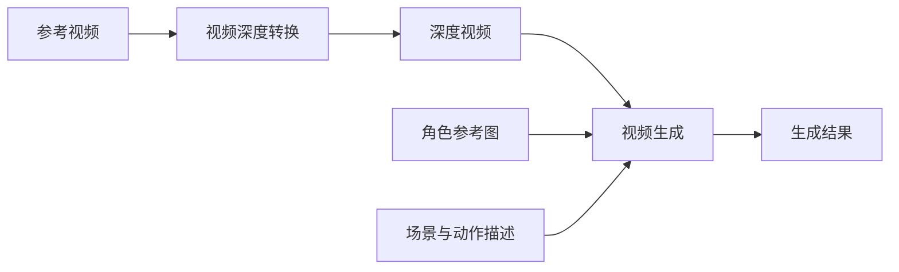

# ReShot 画布视频深度转换整合方案

状态：调研提案，未实施。用户要求先保存，开发时再讨论。本文不代表已批准安装依赖、下载模型、接入付费渠道或开始开发。

## 结论与第一版范围

ReShot 可以作为参考视频预处理能力整合到画布：提取深度控制视频，再将它交给现有视频生成节点，尝试复刻参考片段的动作、空间布局与运镜。

ReShot 不负责生成最终成片。复刻程度取决于控制视频、提示词、参考图片及下游模型，必须通过真实样例验收，不能承诺逐帧一致。

第一版建议限定：单个视频、单个片段、深度快速模式、一个已验证的 Seedance 渠道，以及可预览、下载和复用的控制视频。骨架、边缘、MiniMax H3 和 Wan/ComfyUI 后续独立验证。

## 调研依据

- 仓库：https://github.com/maosika-ai/reshot
- 调研时查询到的 main 提交：`770d7220fe79fdf0fdaa84bdce047b90363fc1b5`。开发前重新核对版本、接口、许可证及模型能力。
- Python API：`RunConfig`、`run()`；支持 depth、pose、canny，处理流程包括规划、解码、模型处理、编码。
- 依赖 Python、PyTorch、OpenCV、FFmpeg。支持缓存已加载模型的长期进程。
- 自带网页服务使用内存任务和单工作线程，不提供本项目所需的持久任务与重启恢复合同。
- 代码采用 Apache-2.0；Small 深度权重标为 Apache-2.0，Base/Large 标为 CC-BY-NC-4.0。第一版固定 Small，分发时保留 LICENSE、NOTICE，并核对实际依赖和权重许可。

源码参考：

- https://github.com/maosika-ai/reshot/blob/main/reshot/pipeline.py
- https://github.com/maosika-ai/reshot/blob/main/reshot/config.py
- https://github.com/maosika-ai/reshot/blob/main/reshot/targets.py
- https://github.com/maosika-ai/reshot/blob/main/reshot/web/__init__.py
- https://github.com/maosika-ai/reshot/blob/main/reshot/backends/vda.py
- https://github.com/maosika-ai/reshot/blob/main/pyproject.toml
- https://github.com/maosika-ai/reshot/blob/main/LICENSE
- https://github.com/maosika-ai/reshot/blob/main/NOTICE

## 当前项目可复用的能力

| 入口 | 已有能力 | 整合缺口 |
| --- | --- | --- |
| `web/src/components/canvas/nodes/media-conversion-node.tsx` | 媒体转换节点、源内容变更检测、图片深度/姿态/边缘交互 | 视频输入目前返回 `video_not_ready`；结果读取仍走图片路径 |
| `web/src/lib/media-conversion/contracts.ts` | 转换操作、状态、来源指纹、输出类型 | 视频片段、处理参数、模型版本、任务和资源关联 |
| `web/src/services/depth-runtime.ts` | 单图深度运行时客户端 | 视频文件传输和异步任务；不能将单图协议直接用于整段视频 |
| `web/src/services/local-runtime-session.ts` | 受保护的本机会话 | 当前只允许精确回环地址；远程 GPU 另走 Go 后端，保留本机边界 |
| `web/src/pages/canvas/canvas-media-generation-executors.ts` | 参考图/视频/音频进入生成任务 | 控制视频输入与来源追踪 |
| `backend/internal/generation/types.go` | 统一参考媒体合同 | 视频控制预处理任务和阶段编排 |
| `plugin-packages/volcengine-ark-seedance/manifest.json` | `reference_video` 映射 | 具体渠道、模型、素材可访问性与规格实测 |
| `backend/internal/protocol/docs/minimax-video.md` | MiniMax 生成和查询合同 | 现有适配器未发送参考视频，不能宣称 H3 已打通 |

## 画布交互

复用媒体转换节点外壳，增加“视频深度转换”入口。输入连接一个视频，支持片段选择；默认深度、快速质量，输出规格按已验证的目标模型选择。

显示排队、读取、推理、编码、完成与错误阶段，支持取消和失败重试。预览区提供原视频与深度视频同步播放。产出普通视频节点，允许下载、保存及连接现有视频生成节点。

可提供“用此深度视频生成”的快捷操作，创建并连接下游视频节点。深度提取和最终生成分开保存；是否提供一次执行两阶段的入口，留待开发前讨论，并明确费用与授权范围。

## 实现边界与运行方式

- React 负责节点设置、预览、连接关系和任务状态展示。
- Go 管理资源归属、任务持久化、调度、结果转存、重试与生成阶段衔接。
- 独立 Python 处理器调用 ReShot，执行视频解码、深度推理和编码。固定依赖、模型版本及权重，避免每次任务重新下载。
- 本机可通过已有 Local Runtime 扩展执行；远程 GPU 通过 Go 后端接入，处理器不直接暴露给前端。
- 部署可为远程处理器提供可选 Docker 服务；Windows 本机验证先使用独立 Python 环境，不改动现有前后端启动方式。
- 本机任务与服务端任务如何关联、重启恢复与取消如何执行，应在能力验证后形成明确合同。不要把浏览器请求中止当成 GPU 任务已取消。

## 数据与任务合同

- 视频先通过现有资源系统保存。处理器接收受控资源或任务专属文件，不接收任意服务器路径；读取和写入校验用户、项目及资源归属。
- 输出作为资源持久化，画布记录资源 ID、来源、任务 ID 和处理参数，大媒体不写入 localStorage。
- 来源记录至少包含输入资源版本或内容哈希、片段范围、控制类型、质量、输出规格、ReShot/权重版本。
- 输入或参数变更后标记旧结果过期，保留旧结果，不自动替换用户已选用的生成参考。
- 缓存键包含完整来源与参数；命中缓存可复用深度结果。
- 深度处理与视频生成分别记录状态和费用。生成失败、取消或额度不足时保留已完成的控制视频。
- 最终生成失败后只重试生成阶段；提交幂等，防止重复生成、计费和重复写入结果。
- 引用素材进入下游模型前校验可访问性、格式、时长、帧率、尺寸和文件大小。ReShot 输出预设不等于当前渠道的能力保证。
- 所有任务支持真实失败原因，区分模型缺失、服务不可用、显存不足、输入无效及下游渠道失败。

## 本机硬件与效果边界

调研时检测到本机 GTX 1650、4GB 显存。ReShot 源码记录快速模式约 3GB、高质量模式约 11GB 显存占用，但来自其他设备的测量，不能保证该机器稳定运行。

优先验证短片和快速模式；显存不足时明确提示，可由用户选择远程 GPU。CPU 路径可验证功能，但性能需测量，不默认承诺可交互速度。

普通参考视频输入与专用 ControlNet 输入是不同协议。第一版选择实际已打通的 Seedance 渠道；H3、Wan/ComfyUI 分别验证。深度/骨架不保证身份特征完全消失，边缘模式尤其保留轮廓；最终效果仍可能出现控制图外观或动作偏差。

## 分阶段实施与验收

1. 能力验证：真实短视频产出可播放的深度 MP4，测量显存、耗时、帧数、时序与输出规格，并完成一次目标渠道生成。决定本机或远程运行方式。
2. 画布闭环：视频输入、片段选择、转换节点、持久任务、结果资源、对照预览、普通视频输出节点和下游生成。验收刷新恢复、取消、重试、保存及来源追踪。
3. 能力扩展：骨架、边缘、MiniMax 参考视频适配，再评估 ComfyUI/Wan 专用控制流程。

验收针对真实处理和真实应用链路：多种画幅与帧率、源视频变更、处理中刷新、进程重启、显存不足、资源授权失败、下游失败重试、额度不足、明暗主题和窄屏交互。模拟处理只用于测试协议，不能作为模型效果验收。

## 开发前待讨论

- 使用哪个实际可调用的 Seedance 模型和渠道？
- 首期采用本机执行、远程 GPU，还是两者均提供？
- 视频深度转换使用现有转换节点的新模式，还是独立产品入口并复用实现？
- 支持的片段时长、文件大小、画幅和质量上限如何确定？
- 深度处理的配额、费用、缓存保留及资源清理规则是什么？
- 哪些参考片段和角色图作为效果验收样例？

调研未安装 ReShot、未下载权重、未运行真实视频推理、未验证付费渠道效果。本文仅保存方案，后续开发需重新核对仓库与接口现状。
